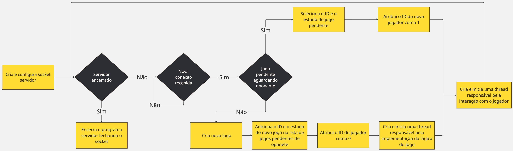

# Pong Sockets

## Descrição

Um jogo multiplayer de Pong implementado com sockets TCP em Python, utilizando a biblioteca Pygame para a interface gráfica. O projeto demonstra a aplicação prática de conceitos de Redes de Computadores e Sistemas Operacionais, como a arquitetura cliente-servidor, comunicação via sockets, manipulação de threads e gerenciamente de áreas críticas com locks para criar um jogo funcional em tempo real.

## Tecnologias Utilizadas

- **Linguagem:** Python 3.8+
- **Bibliotecas:**
  - `pygame`: Para a criação da interface gráfica e renderização do jogo.
  - `socket`: Para a comunicação em rede via Sockets TCP.
  - `threading`: Para o gerenciamento de múltiplos clientes e partidas simultaneamente no servidor.
  - `pickle`: Para a serialização de objetos Python a serem enviados pela rede.
  - `python-dotenv`: Para o gerenciamento de variáveis de ambiente como IP e porta.

## Como Executar

### Requisitos

- Python 3.8 ou superior.
- pip (gerenciador de pacotes do Python).

### Instruções de Execução

**1. Clone do repositório**

Execute os seguintes comandos para clonar e acessar o repositório:

```bash
git clone https://github.com/theo-mattsa/pong-sockets.git
cd pong-sockets
```

**2. Configuração do Ambiente**

Para isolar o programa e suas dependências, evitando problemas de compatibilidade e versionamento, é recomendado usar o script de configuração automática:

```bash
# Conceda permissão de execução e rode o script
chmod +x setup_env.sh
./setup_env.sh
```

Isso irá criar um ambiente virtual, ativá-lo e instalar as dependências do `requirements.txt`.

**3. Configuração da Conexão**

Crie um arquivo chamado .env na raiz do projeto informando o IP e a porta do servidor:

```bash
SERVER_IP=<endereco_ip>
SERVER_PORT=<numero_da_porta>
```

**4. Execute o servidor**

Abra um terminal e inicie o servidor com o script:

```bash
# Conceda permissão de execução e rode o script
chmod +x run_server.sh
./run_server.sh
```

O terminal exibirá a mensagem "Servidor Pong iniciado em...".

**4. Execute o cliente**

Para cada jogador, abra um novo terminal e execute o cliente:

```bash
# Conceda permissão de execução e rode o script
chmod +x run_client.sh
./run_client.sh
```

## Como testar

- Inicie o servidor conforme as instruções acima. Ele ficará aguardando por conexões.
- Inicie o primeiro cliente. Ele pedirá um nome e depois exibirá uma tela de "Aguardando oponente...".
- Assim que o segundo cliente se conectar e enviar seu nome, o servidor iniciará a partida para ambos. Uma contagem regressiva aparecerá, e o jogo começará.
- Controle a raquete com as teclas de seta (esquerda e direita).
- Ao final da partida, uma mensagem de vitória ou derrota será exibida, com a opção de clicar em "Revanche".

## Fluxo de funcionamento

Os fluxogramas abaixo ilustram o fluxo de funcionamento do servidor e do cliente, respectivamente.




## Funcionalidades implementadas

- Multiplayer online: Dois jogadores podem se conectar a um servidor e jogar simultaneamente.
- Sistema de matchmaking: O servidor gerencia uma fila para parear jogadores que se conectam.
- Interface gráfica: Interface desenvolvida com Pygame.
- Dificuldade progressiva: A bola acelera à medida que a partida avança para aumentar a dificuldade gradualmente no jogo.
- Arquitetura cliente-servidor: Comunicação realizada via sockets TCP.
- Opção de Revanche: Jogadores podem votar para jogar novamente após o fim de uma partida.
- Gerenciamento de desconexões: Tratamento adequado quando jogadores saem da partida.
- Segurança em multithreading: Uso de locks para acesso seguro ao estado do jogo em ambiente multi-thread.
- Scripts de automação: Scripts bash para facilitar configuração e execução do projeto.
- Configuração por variáveis de ambiente: Uso de arquivo .env para configurações de rede.
- Física realista: Sistema de colisão e movimento da bola com aceleração progressiva.
- Interface intuitiva: Entrada de nome, feedback visual durante toda a experiência do jogo.
- Múltiplas partidas simultâneas: O servidor suporta várias partidas independentes ao mesmo tempo.

## Possíveis Melhorias Futuras

### Melhorias do Jogo

- Permitir que jogadores joguem com amigos específicos
- Áudio e efeitos sonoros: Som de colisão, música de fundo e vítoria
- Sistema de pontuação durante a realização do jogo
- Ranking entre jogadores
- Permitir que um jogador busque outro oponente sem a necessidade de encerrar o processo.

### Melhorias de Rede

- Mecanismo de reconexão: Permite que jogadores possam se reconectar em caso de desconexão temporária.
- Possível utilização do protocolo UDP para movimentação dos paddles (RAQUETES)
- Possível otimização no tamanho dos dados enviados na rede
- Avaliar utilizar FPS um pouco menor (< 60)
